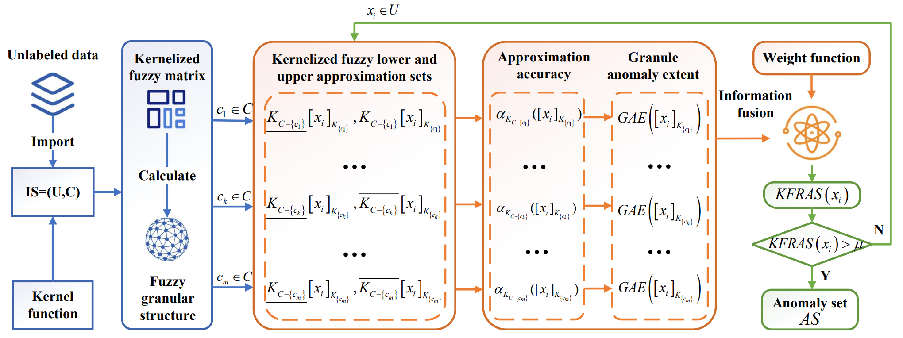

# KFRAD
Yan Wu, Sihan Wang, Hongmei Chen, Dezhong Peng, and **Zhong Yuan***, [Kernelized Fuzzy-Rough Anomaly Detection](Paper/2024-KFRAD.pdf) (Code)

## Abstract
Anomaly detection is a significant area of discovering knowledge that has shown success in the areas of fraud detection, cyber security, and medical diagnostics. The kernelized fuzzy-rough set is a key extension model in rough computing. It inherits the advantages of kernel function and fuzzy-rough set and can handle uncertain information in data more effectively. However, existing kernelized fuzzy-rough set models construct upper and lower approximation sets mainly from decision attribute data which are not available to unlabeled data. In addition, to the best of our knowledge, studies related to the use of kernelized fuzzy upper and lower approximation sets for constructing effective anomaly detection models have not yet been reported. Based on these observations, this paper constructs a kernelized fuzzy-rough set model for unlabeled data and proposes a kernelized fuzzy-rough anomaly detection (KFRAD) method. Specifically, we first optimize the kernel function to compute the fuzzy relation matrix of attribute subsets to construct the fuzzy approximation space. Then, the definition of kernelized fuzzy approximation accuracy for unlabeled data is given. Then, the granule anomaly extent is determined based on the kernelized fuzzy approximation accuracy. Finally, the granule anomaly extents and the corresponding weight values are integrated to compute the kernelized fuzzy-rough anomaly scores of the objects. On the basis of the above detection ideas, we design the KFRAD algorithm and experimentally compare it with mainstream detection algorithms. The analysis results show that the proposed algorithm has better performance. The code is publicly available online at [https://github.com/wwwuyan/KFRAD](https://github.com/wwwuyan/KFRAD).

## Framework



## Usage
You can run KFRAD.py:
```
if __name__ == "__main__":
    load_data = loadmat('KFRAD_Example.mat')
    trandata = load_data['trandata']

    scaler = MinMaxScaler()
    trandata[:, :] = scaler.fit_transform(trandata[:, :])

    delta = 0.3
    out_scores = KFRAD(trandata, delta)

    print(out_scores)
```
You can get outputs as follows:
```
out_scores =
    0.0383
    0.0758
    0.1059
    0.1263
    0.0442
```

## Citation
If you find KFRAD useful in your research, please consider citing:
```

```
## Contact
If you have any questions, please contact [wuyan7958@foxmail.com](wuyan7958@foxmail.com), [yuanzhong@scu.edu.cn](yuanzhong@scu.edu.cn).

